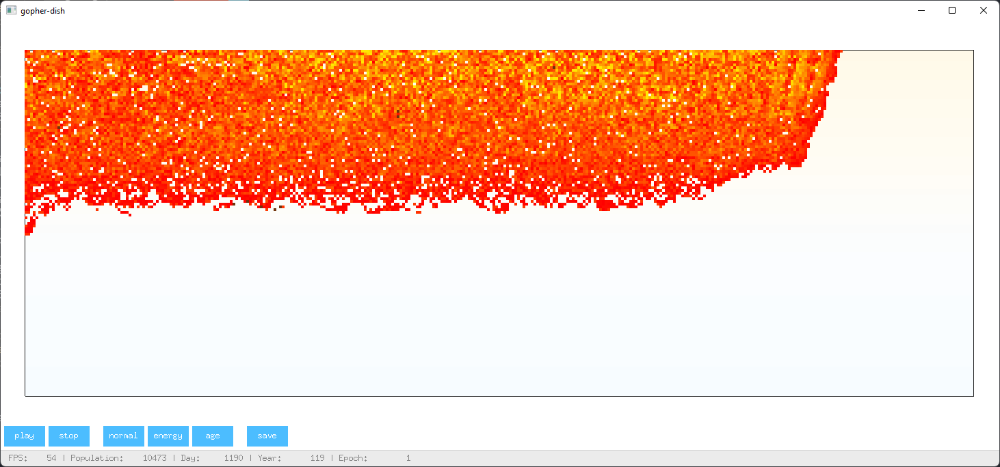

# gopher-dish

### Evolution simulator.

Each cell is a simple virtual machine with its own genome (program). Each instruction decreases the energy of the cell. When the energy drops below zero, the cell dies. Cells can receive energy from the sun (upper half of the map). When the energy rises above the threshold, the cell can reproduce. When a cell reproduces, the genome of its offspring mutates randomly.

Each cell has 4 general purpose registers and 64 bytes of RAM.

### Available instructions

| name       | description                               |                         |
|------------|-------------------------------------------|-------------------------|
| NOP        | no operation                              | :ballot_box_with_check: |
| CMP        | compare                                   | :ballot_box_with_check: |
| JMP        | jump                                      | :ballot_box_with_check: |
| DIVE       | dive into function                        | :ballot_box_with_check: |
| LIFT       | lift from function                        | :ballot_box_with_check: |
| PUT        | put const to mem                          | :ballot_box_with_check: |
| RAND       | put random value to reg                   | :ballot_box_with_check: |
| SAVE       | put reg value to mem                      | :ballot_box_with_check: |
| LOAD       | load mem value to reg                     | :ballot_box_with_check: |
| ADD        |                                           | :ballot_box_with_check: |
| SUB        |                                           | :ballot_box_with_check: |
| MUL        |                                           | :ballot_box_with_check: |
| DIV        |                                           | :ballot_box_with_check: |
| MOVE       | move self cell                            | :ballot_box_with_check: |
| ROTATE     | rotate self cell                          | :ballot_box_with_check: |
| CHECKPOS   | get type of object at near position       | :ballot_box_with_check: |
| CHECKREL   | get releations with cell at near position | :ballot_box_with_check: |
| BITE       | bite another cell                         | :ballot_box_with_check: |
| SHARE      | share energy with near cell               | :ballot_box_with_check: |
| RECYCLE    | recycle something to energy               | :ballot_box_with_check: |
| REPRODUCE  | reproduce                                 | :ballot_box_with_check: |
| PICKUP     | pickup something                          | :black_square_button:   |
| DROP       | drop selected item from bag               | :black_square_button:   |
| BAGSIZE    | count items in bag                        | :black_square_button:   |
| BAGACTIVE  | set active item in bag                    | :black_square_button:   |
| BAGENERGY  | get ebergy of selected item in bag        | :black_square_button:   |
| BAGCHECK   | get type of selected item in bag          | :black_square_button:   |
| GETAGE     | get self age                              | :ballot_box_with_check: |
| GETHEALTH  | get self health                           | :ballot_box_with_check: |
| GETENERGY  | get self energy                           | :ballot_box_with_check: |
| GETCOUNTER | get current command counter               | :ballot_box_with_check: |